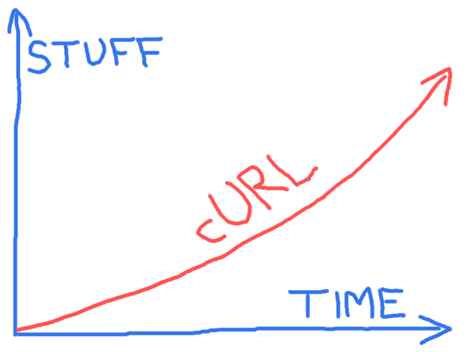

## 未来

cURL的未来,没有放缓的迹象. 错误报告,开发步伐或互联网协议都正在开发或更新.

我们期待更多的协议支持,在已经支持的协议获取更多的功能支持,和更多更好的API允许用户做libcurl传输更快更好.

项目随便维护一个[TODO](https://curl.haxx.se/docs/todo.html)文件中包含了一些我们可以在未来工作的想法.它也保持了[已知Bug](https://curl.haxx.se/docs/knownbugs.html)文档中列出了我们想解决的已知问题列表.

有一个[路线图](https://curl.haxx.se/dev/roadmap.html)描述一些短期计划的文档,一些活跃的开发人员认为他们将在下一步搞一搞.当然,我们不能承诺我们将永远完美地跟随它.

我们高度依赖于开发人员参与并致力于他们想做的事情,无论是bug修复还是新特性.
