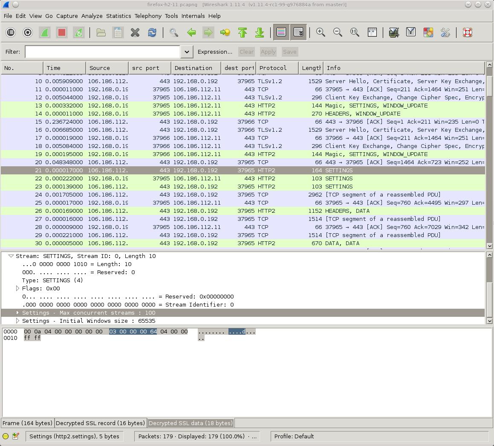
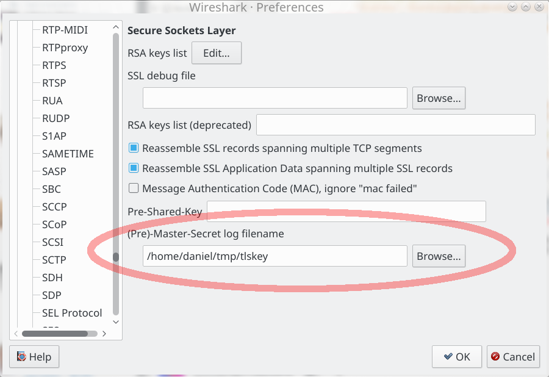

# SSLKIG文件

很久以前,著名的网络分析工具Wireshark(上面的截图)提供了一种在Firefox和Chrome发送和接收TLS流量时解密和检查TLS流量的方法.

这类似于cURL.

你这样做是通过让浏览器或cURL告诉窃听SSL秘密,以便它可以解密它们:

1.  设置环境变量名`SSLKEYLOGFILE`在启动浏览器或cURL之前选择您的文件名.

2.  在WiReSARK中的主秘密字段中设置相同的文件名路径.转到首选项>协议> > SSL,并在下面的屏幕截图中编辑路径.

完成这个简单操作后,现在可以检查WiRESARK中的CURL或浏览器的HTTPS流量.只是超级方便和令人敬畏.

请记住,如果记录TLS流量并希望将其保存以供以后分析,则还需要保存带有秘密的文件,以便以后也能够解密该流量捕获.

## LBCURL也使用应用程序!

支持`SSLKEYLOGFILE`它是由libcurl本身提供的,这使得您可以跟踪和检查TLS网络数据,以获得为使用libcurl而构建的任何应用程序,而不仅仅是curl命令行工具.
