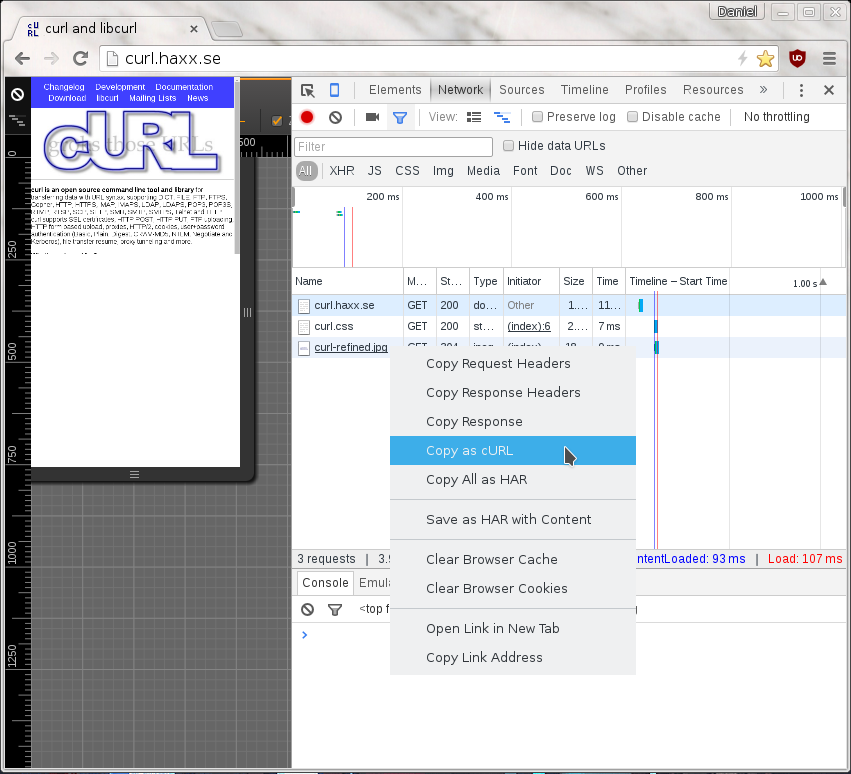
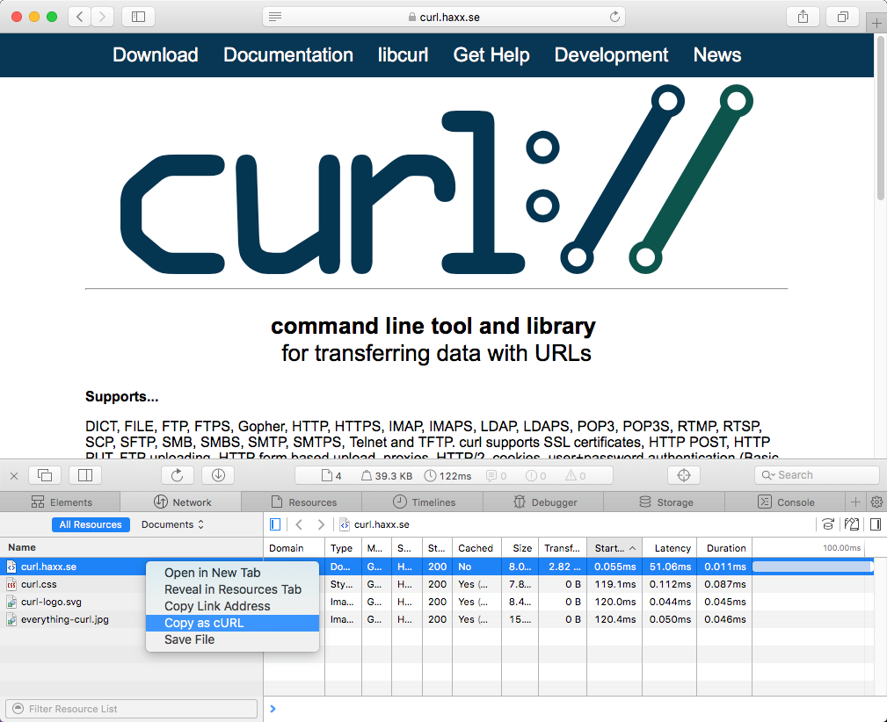

# 卷曲复制

使用curl来执行用户刚刚用浏览器完成的操作是人们请求帮助的常见请求和区域之一.

如何得到一个卷曲命令行来获取资源,就像浏览器会得到它一样,又好又快?Chrome、Firefox和Safari都有这个特性.

## 来自Firefox

你可以通过Firefox的网络工具来展示网站.然后,当看到HTTP流量时,在"Web Developer->Network"工具中右键单击要重复的特定请求,并在出现的菜单中选择"Copy as cURL".如下所示的屏幕截图.然后,操作生成一个卷曲命令行到剪贴板,然后您可以将它粘贴到您最喜欢的shell窗口中.此特性在所有Firefox安装中默认可用.

## 从铬

当您在Chrome中弹出.tools->Developer模式,并选择Network选项卡时,您将看到用于获取站点资源的HTTP流量.在您感兴趣的特定资源的行上,用鼠标右击,然后选择"Copy as cURL",它将在剪贴板中为您生成命令行.在shell中粘贴以获得一个卷曲命令行,以便进行传输.此特性在所有铬和铬装置中默认可用.

## 从狩猎

在Safari中,"开发"菜单在进入首选项之前是不可见的-->高级并启用它.但是,一旦您这样做了,您就可以在开发菜单中选择"Show web inspector",并看到弹出的新控制台类似于Firefox和Chrome的开发工具.

选择网络选项卡,重新加载网页,然后右键单击要用curl获取的特定资源,就像使用Safari一样.

## 在Firefox上,不使用DeVooTo工具

如果这是你想经常做的事情,你可能会发现使用开发工具有点不便和繁琐的弹出只是为了获得命令行复制.然后[克利格特](https://addons.mozilla.org/en-US/firefox/addon/cliget/)这是一个完美的插件,因为它在右键菜单中给了你一个新的选项,所以你可以快速地生成一个快速命令行,就像我在Firefox中右键点击一个图像一样.

## 不完美

这些方法都会给你一条命令行来复制HTTP传输,但是你也会知道它们仍然不是你问题的完美解决方案.为什么?主要是因为这些工具被写入重新运行.*准确的*相同的请求,您复制,而您经常想要重新运行相同的逻辑,但不发送相同的cookie和文件内容的精确副本等.

这些工具将向您提供在请求中发送的具有静态和固定cookie内容的命令行,因为这是浏览器请求中发送的cookie的内容.您很可能希望重写命令行以动态地适应服务器在前面的响应中告诉您的cookie中的内容.等等.

作为卷曲功能的复制也经常臭名昭著的使用不当.`-F`相反,他们提供手工制作.`--data-binary`包括MIME分隔字符串等的解决方案.
